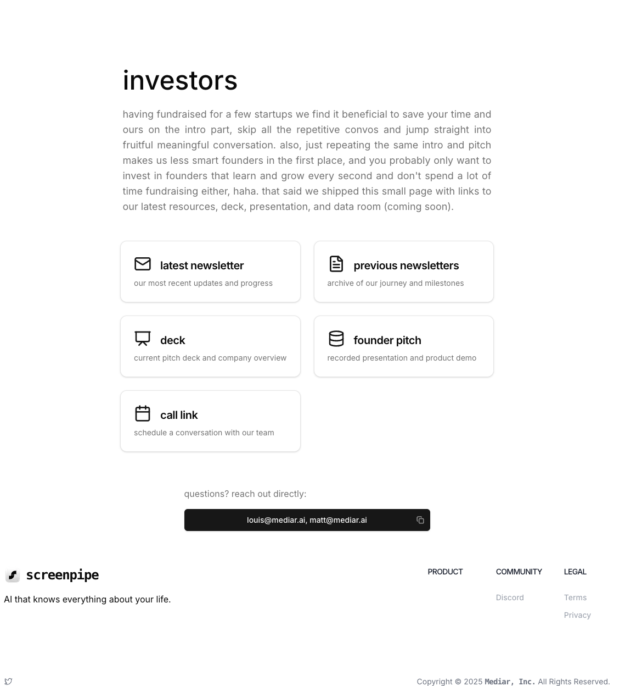

# landing_investor
A fork from the [screenpi.pe/investors](https://screenpi.pe/investors) website



fundraising is hard, but spending time sending out repetitive information about your round is even harder. we've decided to maintain one place for all investor related information on our website. i hereby include the open source version of it

# getting started

```bash
git clone https://github.com/m13v/landing_investor.git
cd landing_investor
npm install
npm run dev
```


# suggestions

i'm happy to turn this into something more meaningful. request features by creating a github issue

potential features:
- file preview
- locked dataroom
- 
